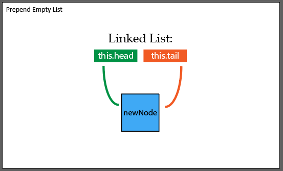
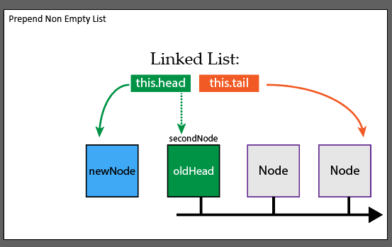
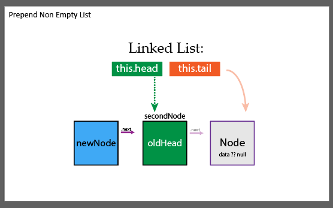
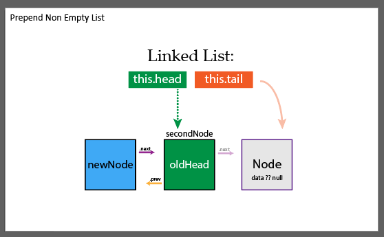
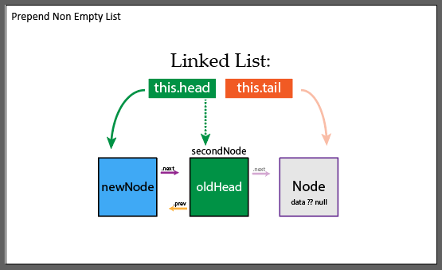
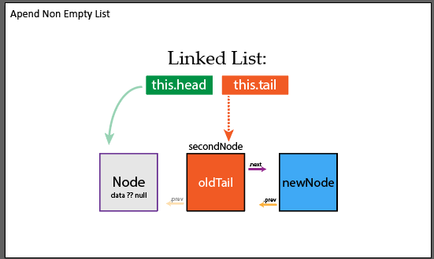
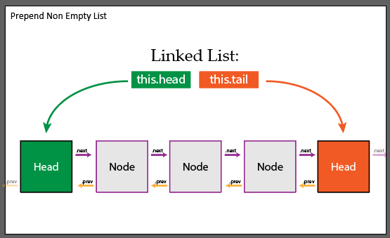

# Visualize a Linked List

## Creating Nodes

Creating a node is fairly simple. We just need a data property to store the data; a next property to link to our next node, and an optional previous property to link our previous node in a doubly linked list

```js
class Node {
  constructor(data) {
    this.data = data;
    this.next = null;
    this.previous = null;
  }
}
```

## Creating Linked List

The linked list itself is also straight forward.

* The head will track the beginning of the list
* The tail will track the end of the list
* And the (optional) length will track the size of our list


```js
export class LinkedList {
  constructor() {
    this.head = null;
    this.tail = null;
    this.length = 0;
}
```

The methods on a linked list are where things get fun

## Prepend Method

We need to be able to add new nodes to our linked list. There are two case to consider here: if the linked list is empty and if the linked list is not empty

### Appending to an empty list

We'll start by creating a new node and checking for an empty list

```js
// add a game to beginning 
  prepend(data) {
    const newNode = new Node(data);

    if (this.head === null) {
      // list is empty, will be first item
      this.head = newNode;
      this.tail = newNode;
    }
  }

```



### Prepend to a non empty list

Now we have to manage if the list is not empty. The goal is to create a new node and push the rest off to the right. Note that we'll never have to modify the tail, since we are adding to the beginning, so our linked list will still always know the last item in the list



#### Find old head and add new node

We'll start by storing the old head in a secondNode variable (since it will now be the second item in the list) and updating our newNode to point to the secondNode

```js
if (this.head === null) {
    // list is empty, will be first item
    this.head = newNode;
    this.tail = newNode;
  } else {
    const secondNode = this.head;
    newNode.next = secondNode;
```



#### Update secondNode to point to newNode

The .previous property on the head node should always be null, so we don't need to update that. But that means the old head(secondNode) has a null .previous property that we have to update. It's .next property is already pointing to the next node, so we don't have to update that

```js
  const secondNode = this.head;
  newNode.next = secondNode; // update new node so that .next points to the new second item in the list
  secondNode.previous = newNode; // update new second to point to new first node
```



#### Update linked list properties

Now, we just need to update the head of the list, update the length of the list, and return the node we added (optional)

```js
    secondNode.previous = newNode; // update new second to point to new first node

    this.head = newNode; // update head to be new first item in list
  }
  this.length++;
  return newNode;
}
```



And that's it! Here is the full method

```js
// add a game to beginning 
  prepend(data) {
    const newNode = new Node(data);

    if (this.head === null) {
      // list is empty, will be first item
      this.head = newNode;
      this.tail = newNode;
    } else {
      const secondNode = this.head;
      newNode.next = secondNode; // update new node so that .next points to the new second item in the list
      secondNode.previous = newNode; // update new second to point to new first node

      this.head = newNode; // update head to be new first item in list
    }
    this.length++;
    return newNode;
  }
```

## Append Method

This method can only be done on a double linked list since we have access to the .previous method. It's the same concept as before, just backward

### Init list if empty

We do the same check as before, it doesn't really matter if we check for a null tail or head, if either are empty it means we have an empty list

```js
append(data) {
    const newNode = new Node(data);

    if (this.tail === null) {
      // list is empty, will be first item
      this.head = newNode;
      this.tail = newNode;
    } else {

```


### Update Non Empty List

#### Find old tail and add new node

Like before, we'll find the old tail and update the pointers so that it links to our newNode. Our newNode should also update it's pointers to the old tail

```js
} else {
      const newSecondLastNode = this.tail;
      newNode.previous = newSecondLastNode;
      newSecondLastNode.next = newNode;
```



#### Update linked list properties

Now we just have to update the pointer on the linked list itself and tell our list that we have a new node!

```js
      this.tail = newNode;
    // end if/else
    }
    this.length++
    return newNode;
  }
```


Here is the full code:

```js
// add game to the end
  append(data) {
    const newNode = new Node(data);

    if (this.tail === null) {
      // list is empty, will be first item
      this.head = newNode;
      this.tail = newNode;
    } else {
      const newSecondLastNode = this.tail;
      newNode.previous = newSecondLastNode;
      newSecondLastNode.next = newNode;
      this.tail = newNode;
    }
    this.length++
    return newNode;
  }
```

## remove Method

```js
remove(valueToRemove) {
    if (!this.head) return null; // list is empty

    let nodeToRemove = null;

    // const obj1 = { key: 'value' };
    // const obj3 = {...obj1}
    // obj3.newKey = 'different' // { key: 'value',  newKey: 'different' // { key: 'value',  newKey}
    // const obj2 = { key: 'value' };

    // console.log(obj1 === obj2); // false
    // console.log(obj1 === obj3); // false

    if(lodash.isEqual(this.head.data, valueToRemove)) { // remove and update the head
      nodeToRemove = this.head;
      this.head = this.head.next; // update head to be second item in the list
      if (this.head === null) { // there was no second, the head was the only item in the list
        this.tail = null;
      } else {
        this.head.previous = null;
      }
      this.length--;
      return nodeToRemove;
    }

    if(lodash.isEqual(this.tail.data, valueToRemove)) { // we have to remove the last item in the list and update tail
      nodeToRemove = this.tail;
      this.tail = this.tail.previous;
      if(this.tail === null) { // we just removed the only node
        this.head = null;
      } else {
        this.tail.next = null;
      }
      this.length--;
      return nodeToRemove
    }


    let currentNode = this.head; // use this var to start at the beginning

    while(currentNode.next !== null) { // the only node that will have .next be null is the last item

      if(lodash.isEqual(currentNode.next.data, valueToRemove)) { // we found it!
        nodeToRemove = currentNode.next;

        const newNeighbor = current.next.next; // store the new neighbor
        currentNode.next = newNeighbor;

        if (currentNode.next === null) { // we just removed the tail
          this.tail = currentNode;
          this.length--;
          return nodeToRemove;
        }

        newNeighbor.previous = current; // remove last reference to nodeToRemove
        this.length--
        return nodeToRemove
      }
      currentNode = currentNode.next;
    }

    return nodeToRemove // no item was found;
  }
```

## toArray Method

We need to convert our data into a usable structure in our code. We can loop through the entire linked list to do so.
We start at the head and simply keep using the .next property to move through the list. The last node in the list, the tail, will always have a null value in it's .next property. That is how we'll know we hit the end of the list 

```js
toArray() {
    const array = [];
    let currentNode = this.head;
    
    while (currentNode.next !== null) {
      array.push(currentNode.data);
      currentNode = currentNode.next
    }

    return array;
  }
```


