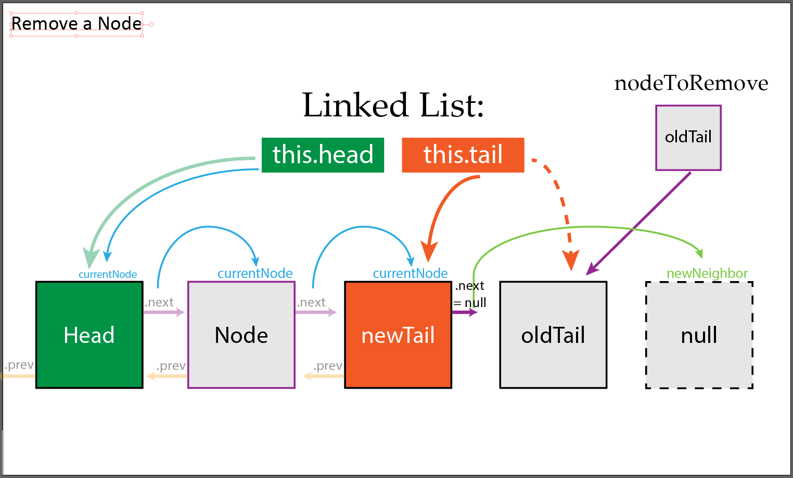

# Visualize a Linked List

## Creating Nodes

Creating a node is fairly simple. We just need a data property to store the data; a next property to link to our next node, and an optional previous property to link our previous node in a doubly linked list

```js
class Node {
  constructor(data) {
    this.data = data;
    this.next = null;
    this.previous = null;
  }
}
```

## Creating Linked List

The linked list itself is also straight forward.

* The head will track the beginning of the list
* The tail will track the end of the list
* And the (optional) length will track the size of our list


```js
export class LinkedList {
  constructor() {
    this.head = null;
    this.tail = null;
    this.length = 0;
}
```

The methods on a linked list are where things get fun

## Prepend Method

We need to be able to add new nodes to our linked list. There are two case to consider here: if the linked list is empty and if the linked list is not empty

### Prepending to an empty list

We'll start by creating a new node and checking for an empty list. We know the list is empty if either the head or the tail are **null**.

```js
// add a game to beginning 
  prepend(data) {
    const newNode = new Node(data);

    if (this.head === null) {
      // list is empty, will be first item
      this.head = newNode;
      this.tail = newNode;
    }
  }

```


Since this is the only item, it will act as both the tail and the head.

### Prepend to a non empty list

Now we have to manage if the list is not empty. The goal is to create a new node and push the rest off to the right. Note that we'll never have to modify the tail, since we are adding to the beginning, so our linked list will still always know the last item in the list.


#### Find old head and add new node

We'll start by storing the old head in a secondNode variable (since it will now be the second item in the list) and updating our newNode to point to the secondNode

```js
if (this.head === null) {
    // list is empty, will be first item
    this.head = newNode;
    this.tail = newNode;
  } else {
    const secondNode = this.head;
    newNode.next = secondNode;
```


#### Update secondNode to point to newNode

The .previous property on the head node should always be **null**, so we don't need to update that. But that means the old head(secondNode) has a **null** .previous property that we have to update. It's .next property is already pointing to the next node, so we don't have to update that

```js
  const secondNode = this.head;
  newNode.next = secondNode; // update new node so that .next points to the new second item in the list
  secondNode.previous = newNode; // update new second to point to new first node
```


#### Update linked list properties

Now, we just need to update the head of the list, update the length of the list, and return the node we added (optional)

```js
    secondNode.previous = newNode; // update new second to point to new first node

    this.head = newNode; // update head to be new first item in list
  }
  this.length++;
  return newNode;
}
```


And that's it! Here is the full method

```js
// add a game to beginning 
  prepend(data) {
    const newNode = new Node(data);

    if (this.head === null) {
      // list is empty, will be first item
      this.head = newNode;
      this.tail = newNode;
    } else {
      const secondNode = this.head;
      newNode.next = secondNode; // update new node so that .next points to the new second item in the list
      secondNode.previous = newNode; // update new second to point to new first node

      this.head = newNode; // update head to be new first item in list
    }
    this.length++;
    return newNode;
  }
```

## Append Method

This method can only be done on a double linked list since we have access to the .previous method. It's the same concept as before, just backward

### Appending to an empty list

We do the same check as before, it doesn't really matter if we check for a **null** tail or head, if either are empty it means we have an empty list

```js
append(data) {
    const newNode = new Node(data);

    if (this.tail === null) {
      // list is empty, will be first item
      this.head = newNode;
      this.tail = newNode;
    } else {

```


### Append Non Empty List

#### Find old tail and add new node

Like before, we'll find the old tail and update the pointers so that it links to our newNode. Our newNode should also update it's pointers to the old tail

```js
} else {
      const newSecondLastNode = this.tail;
      // Point new node to old tail
      newNode.previous = newSecondLastNode;
      // point old tail to new node
      newSecondLastNode.next = newNode;
```


#### Update linked list properties

Now we just have to update the pointer on the linked list itself and tell our list that we have a new node!

```js
      this.tail = newNode;
    // end if/else
    }
    this.length++
    return newNode;
  }
```


Here is the full code:

```js
// add game to the end
  append(data) {
    const newNode = new Node(data);

    if (this.tail === null) {
      // list is empty, will be first item
      this.head = newNode;
      this.tail = newNode;
    } else {
      const newSecondLastNode = this.tail;
      newNode.previous = newSecondLastNode;
      newSecondLastNode.next = newNode;
      this.tail = newNode;
    }
    this.length++
    return newNode;
  }
```

## Remove Method

This method will remove a specified node based on the parameter passed. Remember that we remove nodes by breaking all reference/links to that node.

We'll add some extra functionality by returning the node that was removed, much like the `.slice()` array method returns the removed items.

There will be a lot of cases to work with here. The simplest is the first one: is the list empty

```js
remove(valueToRemove) {
  if (!this.head) return null; // list is empty

  let nodeToRemove = null;
}
```

If the list is empty there is nothing to remove! After that condition, we'll store a **null** value in `nodeToRemove` that we can update when we find the node we want to remove

### Removing the Head

If we remove the head we need to update the linked list properties. Assuming our nodes are storing an object, array, or other complex data type, we'll utilize lodash to do a deep comparison to check if the data we want to remove is the head

```js

if(lodash.isEqual(this.head.data, valueToRemove)) {

}
```

Now we can track the node we are removing, the head, and change the `this.head` on our linked list to be the second item in the list.

```js
if(lodash.isEqual(this.head.data, valueToRemove)) { // remove and update the head
    nodeToRemove = this.head;
    const newHead = this.head.next;
    this.head = newHead;
    // this.head = this.head.next;
}
```


We use the .next property on the head to find the second node, which will now be the new head since we want to remove the current head.
We can then change the value of `this.head` to point to the newHead, breaking one of the links to the node we want to remove.

 (The commented out line is shorthand for what we did here)

#### Check if we removed the only item in the list

As we saw earlier, when only one item is in the list it is both the head and the tail. That also means that both it's .next and .previous properties are **null**. This so if the head was the only item in the list using `this.head.next` will return **null**!


Looks pretty messy, right? Since .next on the old head was a null value (again, meaning there was **not** a second node), we had set the `this.head` of our linked list as **null**. This means the oldHead, the node we removed was the only item in the list.

Our code will confirm that with this condition, `if (this.head === null)`, and now we have to update the tail so it stops pointing at the oldHead

```js
if (this.head === null) { // there was no second, the head was the only item in the list
  this.tail = null;
} else {

}
```


By setting the `this.tail` to **null**, we have now removed all references to the nodeToRemove, allowing it to be garbage collected and making our linked list empty. 

Now we just need a quick line in our else statement to handle when this list does have at least one other node in it

```js
  } else {
    this.head.previous = null;
  }
```


Our newHead was still pointing to the oldHead/nodeToRemove. By setting `.previous` to **null**, we have removed all references to the oldHead and it can now be picked up by the garbage collector. The rest of the nodes are already pointing to the rest of the list, so we're done!

We'll finish this condition by updating the length and returning from the method

```js
  } else {
    this.head.previous = null;
  }
  this.length--;
  return nodeToRemove;
}
```

Here is the full condition

```js
if(lodash.isEqual(this.head.data, valueToRemove)) { // remove and update the head
  nodeToRemove = this.head;
  const newHead = this.head;
  this.head = newHead; // update head to be second item in the list
  // this.head = this.head.next;
  if (this.head === null) { // there was no second, the head was the only item in the list
    this.tail = null;
  } else {
    this.head.previous = null;
  }
  this.length--;
  return nodeToRemove;
}
```

### Removing the Tail

This condition can only be done on a doubly linked list since we need to know the previous node in order for this to work.

It's going to be the same idea of removing the head, just backwards

```js
if(lodash.isEqual(this.tail.data, valueToRemove)) { // we have to remove the last item in the list and update tail
  nodeToRemove = this.tail;
  const newTail = this.tail;
  this.tail = newTail; // update tail to be second to last item in the list
  // this.tail = this.tail.next;
  if(this.tail === null) { // we just removed the only node
    this.head = null;
  } else {
    this.tail.next = null;
  }
  this.length--;
  return nodeToRemove
}
```


* We use `this.tail` to find the second to last node though the `.previous` property
* We update `this.tail` to now point to the second to last node/newTail, removing one connection to the node we want to remove
* If the newTail is **null**, there was not a node there and the item we just removed was the only node in the list.
  * So we set the head to **null** to empty the list
* If the newTail is not **null**, we know we do have more nodes and have to remove the last connection to the `nodeToRemove` be setting the `.next` value of the newTail to **null**
  * The `.next` of the tail should always be **null**!
  * Just like the `.previous` of the head should always be **null**


### Find The Node To Remove

Okay, so now we have to actually look for the data we want to remove if they are not the head or tail.

We start by using a while loop to traverse the entire linked list

```js
let currentNode = this.head; // use this var to start at the beginning

while(currentNode !== null) { // the .next of the tail will be null, breaking the loop

  currentNode = currentNode.next;
}
```


* We start the loop at the head so we can move from the 1st node
* `currentNode = currentNode.next;` will keep moving us through the list since each node will point to their neighbor
* When we reach the tail by accessing the `.next` property we will now be storing a **null** value, since that property will always be null on the tail
* This will break the `while` loop and we have successfully traversed the entire list!

### Finding the node to remove

This code is written work with a singly linked list. You could rewrite it to work better with a doubly linked list but this code will work for both!

Remember, to remove a node we remove all references to it. So  we need to interact with the nodes surrounding the one we want to remove


So we need to write our condition that finds the node to remove like this: 

```js
if(lodash.isEqual(currentNode.next.data, valueToRemove)) {
  nodeToRemove = currentNode.next.data;

  const newNeighbor = current.next.next; // store the new neighbor

}
```


* `currentNode.next.data` ensures that we can still interact with the the node *before* the node to remove via the currentNode variable
  * We do this since we have to remove it's connection to the node we want to remove
  * We can also use that to update the nodeToRemove variable
* Since we still have access to the currentNode, we can chain the `.next` properties to find the node *after* the node we want to remove

### Remove Links to the node to remove

Now that we have have to break the links to the node we want to remove. Again, this is done by interacting with it's surrounding nodes

```js
currentNode.next = newNeighbor;

newNeighbor.previous = currentNode; // remove last reference to nodeToRemove
this.length--;
return nodeToRemove;
```


### If we removed the tail (singly lists)

Since we wrote this as a doubly list, we were already able to manage removing the tail. Though here is the code anyway of how we can manage this if this was a singly linked list.

Since we updated the currentNode's `next` property to link to the new neighbor, we know that we just removed the tail if `next` is now null.

```js
if (currentNode.next === null) { // we just removed the tail
  this.tail = currentNode;
  this.length--;
  return nodeToRemove;
}
```



And that's it 😅! Now we just need to return from the method if we never found a match for the data.

`return nodeToRemove // no item was found;`

Here is the full method

```js
remove(valueToRemove) {
  if (!this.head) return null; // list is empty

  let nodeToRemove = null;

  if(lodash.isEqual(this.head.data, valueToRemove)) { // remove and update the head
    nodeToRemove = this.head.data;
    const newHead = this.head;
    this.head = newHead; // update head to be second item in the list
    // this.head = this.head.next;
    if (this.head === null) { // there was no second, the head was the only item in the list
      this.tail = null;
    } else {
      this.head.previous = null;
    }
    this.length--;
    return nodeToRemove;
  }

  if(lodash.isEqual(this.tail.data, valueToRemove)) { // we have to remove the last item in the list and update tail
    nodeToRemove = this.tail.data;
    const newTail = this.tail;
    this.tail = newTail; // update tail to be second to last item in the list
    // this.tail = this.tail.next;
    if(this.tail === null) { // we just removed the only node
      this.head = null;
    } else {
      this.tail.next = null;
    }
    this.length--;
    return nodeToRemove
  }


  let currentNode = this.head; // use this var to start at the beginning

  while(currentNode.next !== null) { // the only node that will have .next be null is the last item

    if(lodash.isEqual(currentNode.next.data, valueToRemove)) { // we found it!
      nodeToRemove = currentNode.next;

      const newNeighbor = currentNode.next.next; // store the new neighbor

      currentNode.next = newNeighbor; // remove reference to nodeToRemove

      if (currentNode.next === null) { // we just removed the tail
        this.tail = currentNode;
        this.length--;
        return nodeToRemove;
      }

      newNeighbor.previous = currentNode; // remove last reference to nodeToRemove
      this.length--;
      return nodeToRemove;
    }
    currentNode = currentNode.next;
  }

  return nodeToRemove // no item was found;
}
```

## toArray Method

We need to convert our data into a usable structure in our code. We can loop through the entire linked list to do so.
We start at the head and simply keep using the .next property to move through the list. The last node in the list, the tail, will always have a null value in it's .next property. That is how we'll know we hit the end of the list

```js
toArray() {
    const array = [];
    let currentNode = this.head;
    
    while (currentNode !== null) {
      array.push(currentNode.data);
      currentNode = currentNode.next
    }

    return array;
  }
```


